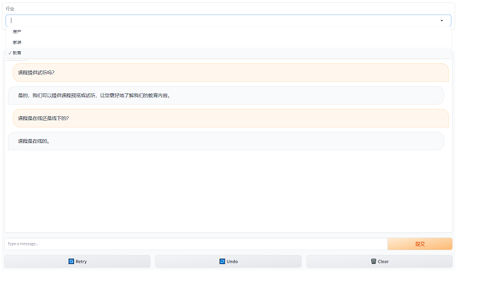

# 销售助手
该部分基于https://github.com/DjangoPeng/openai-quickstart/tree/main/langchain/sales_chatbot 进行增强，能支持多个行业的销售对话。

# 数据
通过如下prompt在 https://chat.openai.com/ 获取原始数据

```
你是中国顶级的家庭装修行业销售，现在培训职场新人，请给出100条实用的销售话术。

每条销售话术以如下格式给出：
[客户问题] {}
[销售回答] {}
```

将<code>家庭装修</code>改为<code>中小学生课外教育</code>则获取跟教育相关的话术。通过FAISS将embedding存入本地磁盘。

# Gradio
以 https://github.com/DjangoPeng/openai-quickstart/blob/main/langchain/sales_chatbot/sales_chatbot.py 为基础，开发能支持多种行业的销售问答：
1. 每一个行业初始化一个FAISS的数据库
2. 在Gradio界面上，引入一个Dropdown来让用户选择对应的行业
3. 实例化ChatInterface时，使用<code>additional_components</code> 来将上述的Dropdown引入
4. 引入一个event listener，可以在用户切换行业的时候清除chat历史记录
5. 在ChatBot的fn中，根据dropdown的不同，选择不同行业相关的FAISS（第一步所初始化的）

样例：


详细请参考[chatbot.py](chatbot.py)